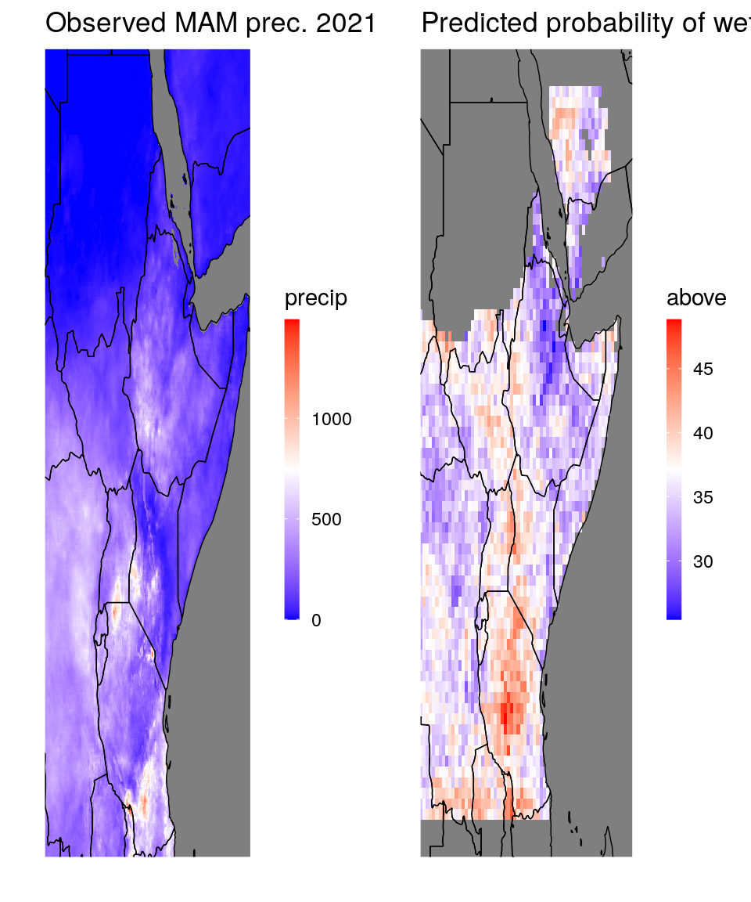
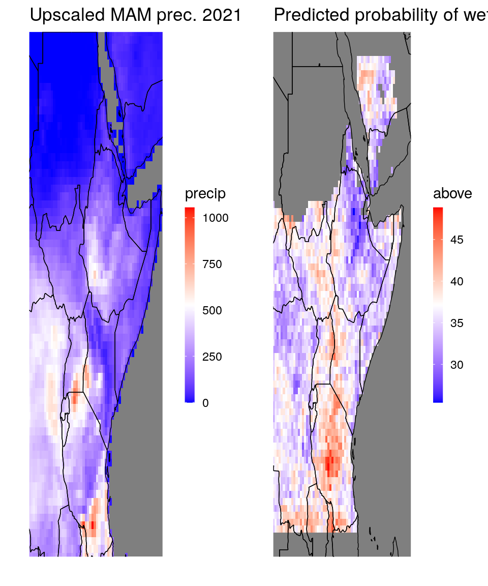
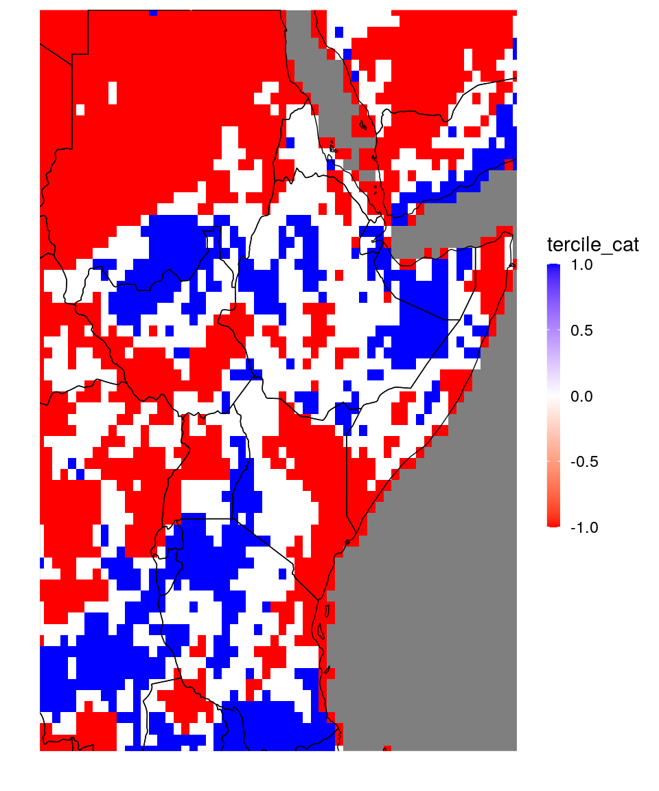
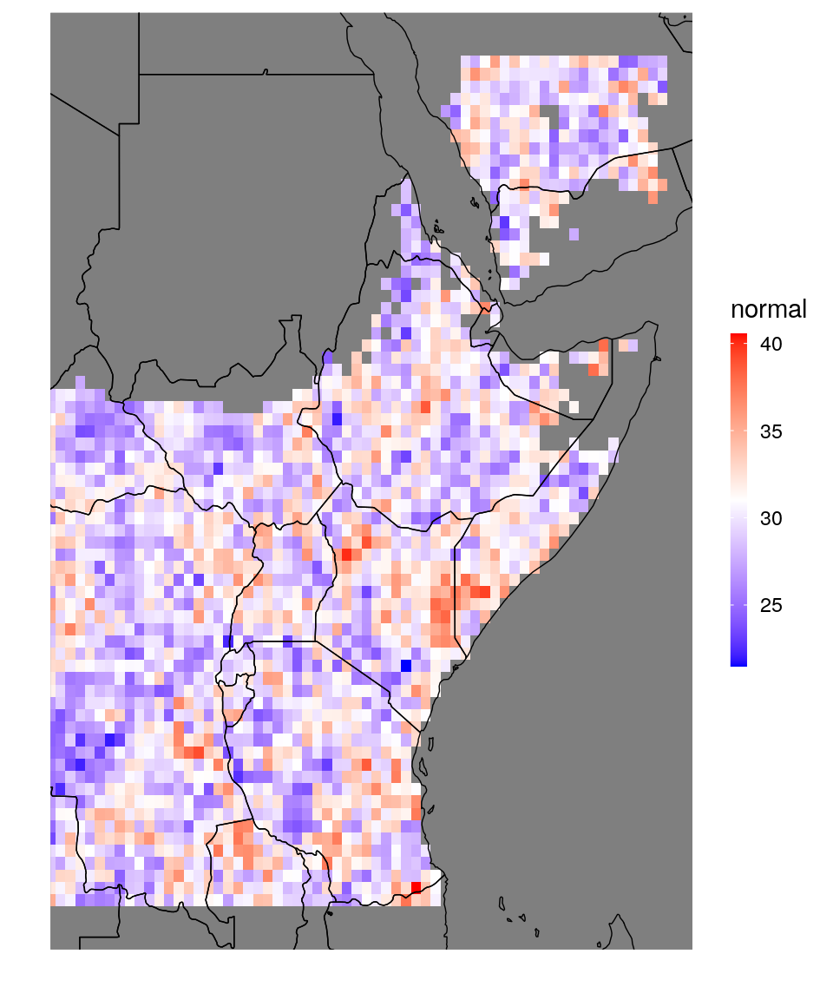

# Reshaping data {#data-examples}

For forecast validation, the ideal data format is to have all your fore- and hindcasts in the same data table, alongside the corresponding observations. So one column of forecasts, one column of observations and several columns of dimension variables (e.g. year, month, lon,lat). However, this is rarely how your netcdf-data looks like: you'll often have different netcdfs for observations and fore-/hindcasts. They might, moreover have different units, different missing values, different variable names etc.

So to get your data into the preferred shape, you either need to manipulate the netcdf files beforehand, to get exactly the data table you want from `netcdf_to_dt`, or you can extract several data tables and do the required manipulations in `R`, using `SeaVal` and `data.table`. In this section we show a few examples how to do this.

### Example 1: cross-validation data {#cv-data}

We first consider a crossvalidation dataset, containing predictions for the February-April rainfall. 


```r
# get the two CV-files:
fn_pred = "CrossValidatedPredictedRain_Feb-Apr_Feb2021.nc"

dt_pred = netcdf_to_dt(paste0(data_dir,fn_pred)) # here data_dir is the local path to the data (not shown)
```

```
## File /nr/project/stat/CONFER/Data/SeaVal/example_data/202102/CrossValidatedPredictedRain_Feb-Apr_Feb2021.nc (NC_FORMAT_CLASSIC):
## 
##      1 variables (excluding dimension variables):
##         float prec[lon,lat,time]   
##             lead: 0
##             average_op_ncl: dim_avg_n over dimension(s): model
##             type: 1
##             _FillValue: -9999
## 
##      3 dimensions:
##         time  Size:35   *** is unlimited *** 
##             units: months since 1981-01-01 
##             calendar: standard
##             _FillValue: 9.96920996838687e+36
##         lat  Size:77 
##             units: degrees_north
##         lon  Size:66 
##             units: degrees_east
## 
##     5 global attributes:
##         MonInit_month: 2
##         valid_time: Feb-Apr
##         creation_date: Mon Feb 15 06:59:57 EAT 2021
##         Conventions: None
##         title:  Cross Validated Predicted Rainfall Total (mm)
```

```r
# let's look at the data:
print(dt_pred)
```

```
##          lon   lat time prec
##      1: 20.5 -13.5   13   NA
##      2: 21.0 -13.5   13   NA
##      3: 21.5 -13.5   13   NA
##      4: 22.0 -13.5   13   NA
##      5: 22.5 -13.5   13   NA
##     ---                     
## 177866: 51.0  24.5  421   NA
## 177867: 51.5  24.5  421   NA
## 177868: 52.0  24.5  421   NA
## 177869: 52.5  24.5  421   NA
## 177870: 53.0  24.5  421   NA
```

```r
# it's also always good to have a look at plots:

dt_plot = dt_pred[time == 13] # subset to only one time-slize, so that we can plot a map
ggplot_dt(dt_plot,'prec')
```


Next we need observations to compare the predictions to. For this first example, we have a prepared netcdf with the observations available:

```r
fn_obs = "ObservedRain_Feb-Apr_Feb2021.nc"
dt_obs = netcdf_to_dt(paste0(data_dir,fn_obs))
```

```
## File /nr/project/stat/CONFER/Data/SeaVal/example_data/202102/ObservedRain_Feb-Apr_Feb2021.nc (NC_FORMAT_CLASSIC):
## 
##      1 variables (excluding dimension variables):
##         float prec[lon,lat,time]   
##             lead: 0
##             average_op_ncl: dim_avg_n over dimension(s): model
##             type: 0
##             _FillValue: -9999
## 
##      3 dimensions:
##         time  Size:35   *** is unlimited *** 
##             units: months since 1981-01-01 
##             calendar: standard
##             _FillValue: 9.96920996838687e+36
##         lat  Size:77 
##             units: degrees_north
##         lon  Size:66 
##             units: degrees_east
## 
##     5 global attributes:
##         MonInit_month: 2
##         valid_time: Feb-Apr
##         creation_date: Mon Feb 15 06:59:57 EAT 2021
##         Conventions: None
##         title:  Observed Rainfall Total (mm)
```

Now we have two data tables, one with predictions and one with observations. We want to merge them together. There are two main functions for merging data tables: `rbindlist` and `merge`. The function `rbindlist` takes several data tables, all with the same columns, and just appends them. This is appropriate when your data tables contain *the same type of information, but for different coordinates*. For example, if you have a data table with observed precipitation for 1990-2020 and a second data table with observed precipitation for 2021-2022. In our example we have two data tables but they contain *different types of information* (the first contains predictions, the second observations). However, they contain them at the same coordinates (meaning at the same locations specified by `lon`/`lat`, and for the same months specified by `time`). Such data tables are joined by the function `merge`. Before we join predictions and observations, we should rename their columns, though: Both of them currently have a column called `prec`, which contains the observations in `dt_obs` and the predictions in `dt_pred`.

```r
setnames(dt_pred,'prec','prediction')
setnames(dt_obs,'prec','observation')

dt = merge(dt_pred,dt_obs,
           by = c('lon','lat','time'))
print(dt)
```

```
##          lon   lat time prediction observation
##      1: 20.5 -13.5   13         NA          NA
##      2: 20.5 -13.5   25         NA          NA
##      3: 20.5 -13.5   37         NA          NA
##      4: 20.5 -13.5   49         NA          NA
##      5: 20.5 -13.5   61         NA          NA
##     ---                                       
## 177866: 53.0  24.5  373         NA          NA
## 177867: 53.0  24.5  385         NA          NA
## 177868: 53.0  24.5  397         NA          NA
## 177869: 53.0  24.5  409         NA          NA
## 177870: 53.0  24.5  421         NA          NA
```
The `by`-argument of the `merge` function identifies the columns that are present in both data tables. These are typically the columns specifying coordinates. 
We now have prediction and observation side by side as we wanted. However, we see that also coordinates with missing values are dragged along (where both the prediction and the observation is `NA`). Let's remove them:

```r
dt = dt[!is.na(prediction)]
```

Also, the `time` column is not really easy to read. Looking at the information printed out by `netcdf_to_dt` above tells us that the unit of time in the netcdf is months since 1981-01-01. `SeaVal` has a function called `MSD_to_YM` that converges time from this 'months-since-date' (MSD) format to years and months (YM), which is typically much more useful:

```r
dt = MSD_to_YM(dt,
               timecol = 'time', # what is the column called that contains the time-since-date coordinates?
               origin = '1981-01-01') # (the origin was documented in the netcdf, see above.)
print(dt) 
```

```
##         lon   lat prediction observation year month
##     1: 20.5 -11.5  316.19452   369.36932 1982     2
##     2: 20.5 -11.5  316.20178   252.47144 1983     2
##     3: 20.5 -11.5  317.43375   267.44031 1984     2
##     4: 20.5 -11.5  313.30789   332.10236 1985     2
##     5: 20.5 -11.5  318.12195   343.65460 1986     2
##    ---                                             
## 79745: 51.5  22.5   25.44651    19.71902 2012     2
## 79746: 51.5  22.5   25.59836    27.55773 2013     2
## 79747: 51.5  22.5   26.03941    25.14965 2014     2
## 79748: 51.5  22.5   26.03053    22.23634 2015     2
## 79749: 51.5  22.5   26.00327    34.84376 2016     2
```

Now the data table looks much better and contains prediction and observation side by side. The column ordering is a bit weird with predictions and observations in the middle, but this usually should not matter.  In section \@ref(cv-eval) we continue this cross-validation example and show how to evaluate the predictions.


### Example 2: Tercile forecasts and upscaling {#us-obs}

In the first example we were lucky that our observations and predictions were of the same format, which is not always the case. We will now look at a more complex example where we prepare a typical tercile forecast for precipitation. We consider again the 2021 MAM season as example. Let's get started with collecting the prediction and corresponding observations:


```r
# predictions:
dt = netcdf_to_dt(paste0(data_dir,'PredictedProbabilityRain_Mar-May_Feb2021_new.nc'),
                  verbose = 0) # suppresses that the function prints all the netcdf-information
print(dt)
```

```
##        lon   lat   normal    above    below
##    1: 20.5 -13.5       NA       NA       NA
##    2: 20.5 -13.0       NA       NA       NA
##    3: 20.5 -12.5       NA       NA       NA
##    4: 20.5 -12.0       NA       NA       NA
##    5: 20.5 -11.5 34.11535 33.56262 32.32204
##   ---                                      
## 5078: 53.0  22.5       NA       NA       NA
## 5079: 53.0  23.0       NA       NA       NA
## 5080: 53.0  23.5       NA       NA       NA
## 5081: 53.0  24.0       NA       NA       NA
## 5082: 53.0  24.5       NA       NA       NA
```

```r
# observation:
dt_obs = netcdf_to_dt(paste0(data_dir,'ObservedChirpsRainTotal_MAM2021.nc'),
                      vars = 'precip', # The netcdf file contains multiple variables, 
                                       # we only want precip.
                      verbose = 1) # This option only prints the units, which are usually the most important part:
```

```
## Units:
## precip: mm/day
## longitude: degrees_east
## latitude: degrees_north
## time: days since 1980-1-1 0:0:0
## bnds:
```

```r
print(dt_obs)
```

```
##         longitude latitude    time    precip
##      1:    21.825  -11.675 15080.5 249.09737
##      2:    21.875  -11.675 15080.5 255.98584
##      3:    21.925  -11.675 15080.5 268.24506
##      4:    21.975  -11.675 15080.5 285.27295
##      5:    22.025  -11.675 15080.5 259.53290
##     ---                                     
## 401964:    51.175   22.225 15080.5  20.28087
## 401965:    51.225   22.225 15080.5  20.08590
## 401966:    51.275   22.225 15080.5  21.04944
## 401967:    51.325   22.225 15080.5  21.87625
## 401968:    51.375   22.225 15080.5  20.30952
```

As we can see, the observation data table looks quite different now. For example, the lon/lat columns are called `longitude` and `latitude`. If we want to visualize the data with the `ggplot_dt` function, we need to rename them:

```r
setnames(dt_obs,c('longitude','latitude'),c('lon','lat'))
```

Let's now look at maps of the prediction and observation side by side
 


```r
pp1 = ggplot_dt(dt_obs,'precip') + ggtitle('Observed MAM prec. 2021')
pp2 = ggplot_dt(dt,'above') + ggtitle('Predicted probability of wet season')

ggpubr::ggarrange(pp1,pp2)
```



We have two problems: First, observations and predictions are on a different spatial scale making it impossible to compare them directly. Second, the observation is only given as mm/month, and the prediction are probabilities for climatology-terciles. Therefore, we need to establish a local climatology first which requires collecting past rainfall observations. Only thereafter we can derive in which climatology-tercile the 2021 observation falls.

Lets first get observations and predictions onto the same scale. For validation, it is usually more appropriate to upscale everything to the coarser scale.
To this end we use the upscaling function `upscale_regular_lon_lat`


```r
dt_obs = upscale_regular_lon_lat(dt_obs,
                                 coarse_grid = dt,  # to which grid do you want to upscale?
                                 uscols = 'precip') # which column contains the data for upscaling?

pp3 = ggplot_dt(dt_obs,'precip') + ggtitle('Upscaled MAM prec. 2021')
ggpubr::ggarrange(pp3,pp2)
```



Now, let us address the second problem, namely assessing where the precipitation was above or below normal. The observation we loaded contains the CHIRPS MAM average for 2021. As we showed in Section \@ref(chirps), the `SeaVal` package provides convenient functions for locally storing CHIRPS data and loading it. So we can load a 30-year reference period like this:

```r
dt_past_obs = load_chirps(years = 1990:2020, months = 3:5)
print(dt_past_obs)
```

```
##          lon   lat       prec year month
##      1: 21.5 -12.0 4.77311503 1990     3
##      2: 22.0 -12.0 4.78173981 1990     3
##      3: 22.5 -12.0 4.84994405 1990     3
##      4: 23.0 -12.0 5.50729116 1990     3
##      5: 23.5 -12.0 6.09404551 1990     3
##     ---                                 
## 397106: 49.5  22.5 0.07670408 2020     5
## 397107: 50.0  22.5 0.07071957 2020     5
## 397108: 50.5  22.5 0.05828492 2020     5
## 397109: 51.0  22.5 0.05185558 2020     5
## 397110: 51.5  22.5 0.04811331 2020     5
```

As we can see, the past observations are monthly, but we want the MAM season total. Moreover, the local CHIRPS data is stored in mm/day. So let us convert the units and sum the precipitation over the season:


```r
dt_past_obs[,prec := 30*prec] # conversion to mm
dt_past_obs = dt_past_obs[,.(precip = sum(prec)), by = .(lon,lat,year)]
```

Now `dt_past_obs` and `dt_obs` look very similar and we can join them together:

```r
dt_obs[,year := 2021]
dt_obs = rbindlist(list(dt_past_obs,dt_obs), 
                   use.names = TRUE) 
```

Now we can derive into which local climatology-tercile the precipitation of 2021 falls, by comparing with past observations. To this end we use the utility-function `add_tercile_cat`. The function establishes a climatology, and calculates into which tercile category each value falls: 


```r
dt_obs = add_tercile_cat(dt_obs, 
                         by = c('lon','lat'), # calculate the climatology and category separately for each location
                         datacol = 'precip')
print(dt_obs)
```

```
##          lon   lat year     precip tercile_cat
##      1: 21.5 -12.0 1990 297.175501           1
##      2: 22.0 -12.0 1990 291.388758           0
##      3: 22.5 -12.0 1990 295.368593           0
##      4: 23.0 -12.0 1990 320.389480           1
##      5: 23.5 -12.0 1990 329.227399           1
##     ---                                       
## 135638: 51.5  20.5 2021  25.209672           1
## 135639: 51.5  21.0 2021  21.710808           0
## 135640: 51.5  21.5 2021  23.181606           0
## 135641: 51.5  22.0 2021  23.292844          -1
## 135642: 51.5  10.5 2021   1.161395          -1
```

```r
ggplot_dt(dt_obs[year == 2021],'tercile_cat',low = 'red',high = 'blue')
```



As we can see, the observation now contains a column `tercile_cat` that tells us whether the rainfall at this location in a given year was below normal (-1), normal (0) or above normal (1). For later use, we also add the local climatology:

```r
dt_obs[,clim := mean(precip),by = .(lon,lat)]
```

Finally, we can merge observations and predictions. We only need the observation for 2021 (now that we have derived the tercile category).

```r
dt = merge(dt,dt_obs[year == 2021],by = c('lon','lat'))
# transform percentage prediction to probabilities between zero and one:
dt[,normal := normal/100]
dt[,above := above/100]
dt[,below := below/100]

print(dt)
```

```
##        lon   lat    normal     above     below year    precip tercile_cat
##    1: 22.0 -11.5 0.2794044 0.3959641 0.3246315 2021 271.66260          -1
##    2: 22.0 -11.0 0.3176142 0.3509704 0.3314154 2021 279.14212          -1
##    3: 22.0 -10.5 0.2897301 0.3781255 0.3321443 2021 300.32638          -1
##    4: 22.0 -10.0 0.3133837 0.3520903 0.3345260 2021 332.45747           0
##    5: 22.0  -9.5 0.3076811 0.3480890 0.3442299 2021 407.19511           1
##   ---                                                                    
## 3268: 51.5  20.0        NA        NA        NA 2021  26.43543           1
## 3269: 51.5  20.5        NA        NA        NA 2021  25.20967           1
## 3270: 51.5  21.0        NA        NA        NA 2021  21.71081           0
## 3271: 51.5  21.5        NA        NA        NA 2021  23.18161           0
## 3272: 51.5  22.0        NA        NA        NA 2021  23.29284          -1
##            clim
##    1: 311.90872
##    2: 331.75210
##    3: 333.75472
##    4: 335.87600
##    5: 350.41710
##   ---          
## 3268:  25.26015
## 3269:  24.40523
## 3270:  22.87279
## 3271:  24.11377
## 3272:  27.69789
```

We continue to work with this dataset in Section \@ref(eval-terciles), where we evaluate this example prediction.


### Example: 'corrupted' netcdf{#ex-corrupted-netcdf}

Data handling can be messy and things can go wrong at any stage. Here, we have a look at a netcdf file where something has gone wrong:


```r
fn = "PredictedProbabilityRain_Feb-Apr_Feb2021.nc"
dt = netcdf_to_dt(paste0(data_dir,fn))
```

```
## File /nr/project/stat/CONFER/Data/SeaVal/example_data/202102/PredictedProbabilityRain_Feb-Apr_Feb2021.nc (NC_FORMAT_CLASSIC):
## 
##      3 variables (excluding dimension variables):
##         float below[lon,lat]   
##             lead: 0
##             average_op_ncl: dim_avg_n over dimension(s): model
##             type: 0
##             _FillValue: -1
##         float normal[ncl4,ncl3]   
##             _FillValue: -1
##         float above[lon,lat]   
##             lead: 0
##             average_op_ncl: dim_avg_n over dimension(s): model
##             type: 2
##             _FillValue: -1
## 
##      5 dimensions:
##         time  Size:0   *** is unlimited *** (no dimvar)
##         lat  Size:77 
##             units: degrees_north
##         lon  Size:66 
##             units: degrees_east
##         ncl3  Size:77 (no dimvar)
##         ncl4  Size:66 (no dimvar)
## 
##     6 global attributes:
##         units: mm
##         MonInit_month: 2
##         valid_time: Mar-May
##         creation_date: Mon Feb 15 06:59:57 EAT 2021
##         Conventions: None
##         title: Predicted Tercile probability
```

```
## Error in netcdf_to_dt(paste0(data_dir, fn)): Your file has variables with disjoint dimensions, which should not be stored in a single data table. Either set trymerge to FALSE or select variables with overlapping dimensions in vars.
```

The `netcdf_to_dt` function prints out the netcdf information, and then crashes with the error message above, saying that we have disjoint dimension variables for some variables. Indeed, looking at the printed out netcdf-description, we have three variables (below,normal,above), and while 'below' and 'above' are indexed by 'lon' and 'lat', 'normal' is indexed by 'ncl3' and 'ncl4'. As the error message suggests, we can set `trymerge` to FALSE, making `netcdf_to_dt` return a list of data tables, rather than a single data table. 


```r
dt_list = netcdf_to_dt(paste0(data_dir,fn),trymerge = FALSE,verbose = 0)
print(dt_list)
```

```
## [[1]]
##        lon   lat below
##    1: 20.5 -13.5    NA
##    2: 21.0 -13.5    NA
##    3: 21.5 -13.5    NA
##    4: 22.0 -13.5    NA
##    5: 22.5 -13.5    NA
##   ---                 
## 5078: 51.0  24.5    NA
## 5079: 51.5  24.5    NA
## 5080: 52.0  24.5    NA
## 5081: 52.5  24.5    NA
## 5082: 53.0  24.5    NA
## 
## [[2]]
##       ncl4 ncl3 normal
##    1:    1    1     NA
##    2:    2    1     NA
##    3:    3    1     NA
##    4:    4    1     NA
##    5:    5    1     NA
##   ---                 
## 5078:   62   77     NA
## 5079:   63   77     NA
## 5080:   64   77     NA
## 5081:   65   77     NA
## 5082:   66   77     NA
## 
## [[3]]
##        lon   lat above
##    1: 20.5 -13.5    NA
##    2: 21.0 -13.5    NA
##    3: 21.5 -13.5    NA
##    4: 22.0 -13.5    NA
##    5: 22.5 -13.5    NA
##   ---                 
## 5078: 51.0  24.5    NA
## 5079: 51.5  24.5    NA
## 5080: 52.0  24.5    NA
## 5081: 52.5  24.5    NA
## 5082: 53.0  24.5    NA
```

We see that 'ncl3' and 'ncl4' have different values than 'lon' and 'lat', apparently they are meaningless indexing integers. However, the three data.tables are of the same size, and we can hope that the 'below' data table is arranged in the same row-ordering than the others. If this is the case, we can simply extract the 'normal' column from it (as vector) and attach it to one of the others. Let's try:


```r
dt = dt_list[[1]]
normal_probs_as_vector = dt_list[[2]][,normal]
dt[,normal := normal_probs_as_vector]

ggplot_dt(dt,'normal')
```


Plotting is usually a great way to see whether data got arranged correctly:  Here, we can be fairly certain it did, simply because the missing values in the 'normal' vector are at the locations where they should be (over water and dry regions). If the ordering would have been differently, these would likely be all over the place. However, let's run another test to be certain:


```r
# attach the 'above'-data table:
dt = merge(dt,dt_list[[3]],by = c('lon','lat'))
print(dt)
```

```
##        lon   lat    below   normal    above
##    1: 20.5 -13.5       NA       NA       NA
##    2: 20.5 -13.0       NA       NA       NA
##    3: 20.5 -12.5       NA       NA       NA
##    4: 20.5 -12.0       NA       NA       NA
##    5: 20.5 -11.5 31.13112 35.07441 33.79448
##   ---                                      
## 5078: 53.0  22.5       NA       NA       NA
## 5079: 53.0  23.0       NA       NA       NA
## 5080: 53.0  23.5       NA       NA       NA
## 5081: 53.0  24.0       NA       NA       NA
## 5082: 53.0  24.5       NA       NA       NA
```

```r
# if the ordering of the 'normal' column was correct, we have below + normal + above = 100%:
check = rowSums(dt[,.(below,normal,above)])
print(check[1:20])
```

```
##  [1]  NA  NA  NA  NA 100 100 100 100 100 100 100 100 100 100 100 100 100 100 100
## [20] 100
```

```r
mean(check[!is.na(check)])
```

```
## [1] 100
```

This shows that the ordering was correct. We also could have solved this differently, by using $\text{below} + \text{normal} + \text{above} = 100\%$ directly:


```r
# only extract 'below' and 'above':
dt = netcdf_to_dt(paste0(data_dir,fn), vars = c('below','above'),verbose = 0)
print(dt)
```

```
##        lon   lat    below    above
##    1: 20.5 -13.5       NA       NA
##    2: 20.5 -13.0       NA       NA
##    3: 20.5 -12.5       NA       NA
##    4: 20.5 -12.0       NA       NA
##    5: 20.5 -11.5 31.13112 33.79448
##   ---                             
## 5078: 53.0  22.5       NA       NA
## 5079: 53.0  23.0       NA       NA
## 5080: 53.0  23.5       NA       NA
## 5081: 53.0  24.0       NA       NA
## 5082: 53.0  24.5       NA       NA
```

```r
dt[,normal := 100 - below - above]
ggplot_dt(dt,'normal')
```




### Example: preparing data for evaluating exceedence probabilities{#data-ex-prexc}

Here we show how to prepare data for evaluating exceedence probabilities, see Section \@ref(eval-ex-pr).


```r
fn = 'PrecRegPeXcd_3monthSeasonal.nc'
dt = netcdf_to_dt(paste0(data_dir,fn))
```

```
## File /nr/project/stat/CONFER/Data/SeaVal/example_data/202102/PrecRegPeXcd_3monthSeasonal.nc (NC_FORMAT_CLASSIC):
## 
##      1 variables (excluding dimension variables):
##         float pexcd[lon,lat,model,lead,rthr]   
##             thrhold4: 400
##             thrhold3: 350
##             thrhold2: 300
##             thrhold1: 200
##             units: %
##             _FillValue: -9999
## 
##      6 dimensions:
##         time  Size:0   *** is unlimited *** (no dimvar)
##         rthr  Size:4 
##         lead  Size:6 
##             units: months since 2021-2-1 0:0 
##         model  Size:9 
##             names: GEM-NEMO CanCM4i NASA-GEOSS2S GFDL-SPEAR COLA-RSMAS-CCSM4 NCEP-CFSv2 ECMWF Meteo_France UKMO
##         lat  Size:77 
##             units: degrees_north
##         lon  Size:66 
##             units: degrees_east
## 
##     5 global attributes:
##         modelnames: GEM-NEMO CanCM4i NASA-GEOSS2S GFDL-SPEAR COLA-RSMAS-CCSM4 NCEP-CFSv2 ECMWF Meteo_France UKMO
##         nmodels: 9
##         initial_time: Feb2021
##         creation_date: Thu Feb 25 19:58:57 EAT 2021
##         title:  Forecast probabilities of Exceedance
```

```r
print(dt)
```

```
##           lon   lat model lead rthr pexcd
##       1: 20.5 -13.5     0    0    0    NA
##       2: 21.0 -13.5     0    0    0    NA
##       3: 21.5 -13.5     0    0    0    NA
##       4: 22.0 -13.5     0    0    0    NA
##       5: 22.5 -13.5     0    0    0    NA
##      ---                                 
## 1097708: 51.0  24.5     8    5    3    NA
## 1097709: 51.5  24.5     8    5    3    NA
## 1097710: 52.0  24.5     8    5    3    NA
## 1097711: 52.5  24.5     8    5    3    NA
## 1097712: 53.0  24.5     8    5    3    NA
```

```r
# first, note that the 'model', 'rthr', and 'month' column do not make much sense before we insert
# the information we gather from the netcdf description above:
modelnames = c('GEM-NEMO',
               'CanCM4i',
               'NASA-GEOSS2S',
               'GFDL-SPEAR',
               'COLA-RSMAS-CCSM4',
               'NCEP-CFSv2',
               'ECMWF',
               'Meteo_France',
               'UKMO')
thresholds = c(200,300,350,400)

dt[,model := modelnames[model + 1]]
dt[,rthr := thresholds[rthr + 1]]
dt[,month :=lead + 2][,lead:=NULL]
```

Ultimately, we want to compare the skill of these models to a climatological forecast. The climatological forecast for the exceedence probability is just the fraction of observed years where the threshold was exceeded. To calculate this, we require past observations. So let us load chirps again, only for the months contained in `dt`:

```r
dt_chirps = load_chirps(months = unique(dt[,month]))
dt_chirps[,prec:=30*prec] # convert to mm
```

In order to get the climatological exceedence probabilities, we can use the following function:

```r
clim_fc = climatology_threshold_exceedence(dt_chirps,
                                           o = 'prec',
                                           thresholds = unique(dt[,rthr]),
                                           by = c('month','lon','lat'))

print(clim_fc)
```

```
##          month  lon   lat year     pexcd threshold
##       1:     2 21.5 -12.0 1981 0.3414634       200
##       2:     2 22.0 -12.0 1981 0.4634146       200
##       3:     2 22.5 -12.0 1981 0.5121951       200
##       4:     2 23.0 -12.0 1981 0.6585366       200
##       5:     2 23.5 -12.0 1981 0.5609756       200
##      ---                                          
## 4304156:     7 49.5  22.5 2022 0.0000000       400
## 4304157:     7 50.0  22.5 2022 0.0000000       400
## 4304158:     7 50.5  22.5 2022 0.0000000       400
## 4304159:     7 51.0  22.5 2022 0.0000000       400
## 4304160:     7 51.5  22.5 2022 0.0000000       400
```

Note that we passed the thresholds given in `dt`. The `by` argument tells the function what columns to group by when computing the climatology. Finally, we need to merge the predictions, the climatological forecast and the observation into one data table. Since we only have predictions for 2021, it is enough to provide the climatology forecast and observation for 2021 as well. Also note that we have predictions for more months than observations (at the time this is written), so we cut the predictions for June and July out - we cannot evaluate predictions we don't know the outcome for.


```r
setnames(clim_fc,c('pexcd','threshold'),c('clim','rthr'))
dt = merge(dt,clim_fc[year == 2021,],by = c('lon','lat','month','rthr'))
dt = merge(dt,dt_chirps[year == 2021],by = c('lon','lat','month','year'))

#finally, for evaluation we generally work with probabilities between 0 and 1, not percentages:
range(dt[,pexcd],na.rm = TRUE) # confirm that the data table contains percentages at the moment...
```

```
## [1]   0 100
```

```r
dt[,pexcd := pexcd/100] #... and correct

print(dt)
```

```
##          lon   lat month year rthr            model pexcd      clim       prec
##      1: 21.5 -12.0     2 2021  200         GEM-NEMO 0.996 0.3170732 213.685669
##      2: 21.5 -12.0     2 2021  200          CanCM4i 0.995 0.3170732 213.685669
##      3: 21.5 -12.0     2 2021  200     NASA-GEOSS2S 0.996 0.3170732 213.685669
##      4: 21.5 -12.0     2 2021  200       GFDL-SPEAR 0.990 0.3170732 213.685669
##      5: 21.5 -12.0     2 2021  200 COLA-RSMAS-CCSM4 0.993 0.3170732 213.685669
##     ---                                                                       
## 922316: 51.5  22.5     7 2021  400 COLA-RSMAS-CCSM4 0.000 0.0000000   9.597914
## 922317: 51.5  22.5     7 2021  400       NCEP-CFSv2 0.000 0.0000000   9.597914
## 922318: 51.5  22.5     7 2021  400            ECMWF    NA 0.0000000   9.597914
## 922319: 51.5  22.5     7 2021  400     Meteo_France    NA 0.0000000   9.597914
## 922320: 51.5  22.5     7 2021  400             UKMO    NA 0.0000000   9.597914
```
How to evaluate the predictions from here is discussed in Section \@ref(eval-ex-pr).


